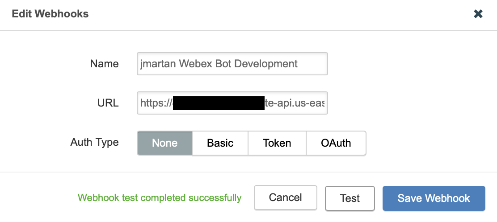

## What is TE Alert Bot
This is a Webex Bot which can resend [ThousandEyes](https://thousandeyes.com) alerts to Webex Space(s).

### How it works
The Bot has two URLs. Its root URL listens for ThousandEyes webhooks, **/webex** listens for Webex webhooks. Data recevied from ThousandEyes are replicated to all group and 1-1 Webex Spaces in which the Bot is a member.


## How to run
The TE Alert Bot runs in Flask WSGI. It is designed to run in Amazon Lambda. Use [Zappa](https://github.com/zappa/Zappa) to deploy it. It can also run locally in Flask development mode.

Open [ThousandEyes Alerts](https://app.thousandeyes.com/settings/alerts), then open existing alert or create a new one. In alert **Notification** click **Edit webhooks**. Paste the Bot's root URL to the webhook URL. Click **Test**. If the test succeeds, the Bot should send a JSON test message to all Spaces which it is a member of.  



## Installing & running locally
### Requirements:
* NGROK account and software installed

### Installation / initialization steps:
1. initialize virtual environment `python3 -m venv venv`
2. switch to virtual environment `source venv/bin/activate`
3. install required packages `pip install -r requirements.txt`
4. start NGROK, forward HTTP to local port 5051 `ngrok http 5051`
5. create a Webex Teams Bot at https://developer.webex.com/my-apps/new, get Bot ID and Access Token
6. copy `.env_sample` to `.env_local`, paste Access Token to `WEBEX_TEAMS_ACCESS_TOKEN`
7. use Access Token to get the Bot Id. Either visit the https://developer.webex.com/docs/api/v1/people/get-my-own-details
and replace the Authorization with the Bot's Access Token, or run `curl https://webexapis.com/v1/people/me -H "Authorization: Bearer <paste_bot_access_token>"`. Get the value of **id**. Paste the Bot id to `BOT_ID` in .env_local.
8. start the Bot `dotenv -f .env_local run python te_bot.py`

### Testing the Bot
1. copy the URL provided by NGROK and open it in a web browser
2. the GET request from the web browser initializes the Bot's webhooks, success screen should be displayed int the browser
3. add Bot to a space
4. create TE alert and webhook in alert notifications as described above
5. click **Test** in webhook configuration
6. try creating an alert in ThousandEyes console

## AWS Lambda / Zappa Notes
The Bot is using [python-dotenv](https://pypi.org/project/python-dotenv/) to pass sensitive information, like Access Token, to the Python script. AWS Lambda with [Zappa](https://github.com/zappa/Zappa) allows to run multiple  instances of the same application. For example **dev**, **production**, etc. In order to allow the Vote Bot to run in such an environment the Bot allows Zappa to pass **DOT_ENV_FILE** environment variable to the script. **DOT_ENV_FILE** is a filename which contains the environment variables loaded by Dotenv. If there is no **DOT_ENV_FILE** the Bot loads the variables from **.env** file. So if you used **.env_local** to run the Bot locally, copy it to **.env** before loading the script to AWS. Or you can set the **DOT_ENV_FILE** in **zappa_settings.json** to use a different .env file for each application instance. For example:
```
{
    "dev": {
      ...
        "environment_variables": {
            "DOT_ENV_FILE": ".env_local"
        },
    },
    "prod": {
      ...
        "environment_variables": {
            "DOT_ENV_FILE": ".env_prod"
        }
    }
}
```
Consult the [Zappa](https://github.com/zappa/Zappa) documentation on how to set it up and get it working
with your AWS account.
